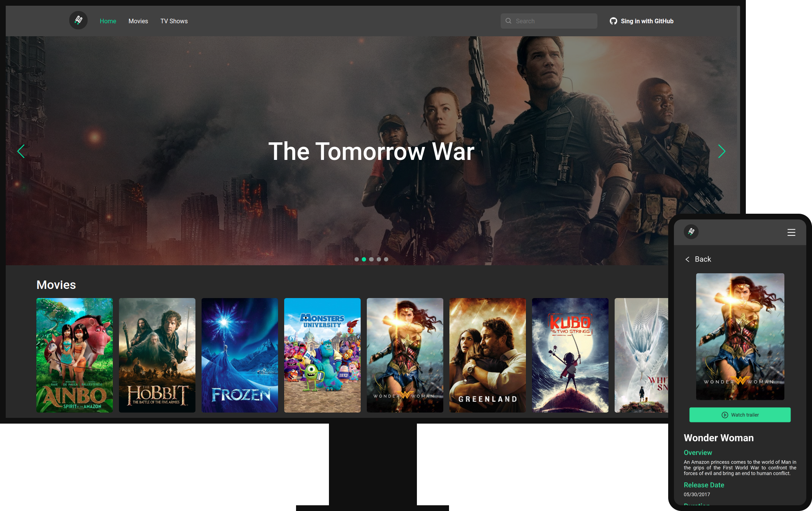
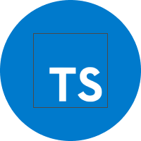
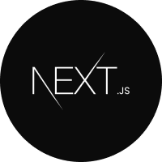
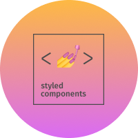

<div align="center">
  
</div>


<h1 align="center">Your cinema database</h1>



## About
Jetflix gives you information about everything related to cinema. The goal of the project is to improve my skills with React and Next.js. All the data of the project is provided by [TMDb API](https://developers.themoviedb.org/3).

## Technologies

### React
[](https://reactjs.org/)

### Typescript
[](https://www.typescriptlang.org/)

### Next.js
[](https://nextjs.org/)

### Styled Components
[](https://styled-components.com/)

# Usage
This application is currently hosted on Vercel and you can access is by clicking [here](https://jetflix.vercel.app/).

To run the project on your machine you'll need to follow these steps:

1 - Clone the project by running the command `git clone https://github.com/Eduardo-H/jetflix.git` on your bash terminal.

2 - Go to the project's directory using `cd jetflix/`.

3 - Install all the project's dependencies by running `yarn`.

4 - Next you will need a TMDb API key to fetch the data correctly, you can request a API key [here](https://www.themoviedb.org/settings/api).

5 - If you want to make the GitHub oAuth sign in work, it's necessary to create an oAuth application in GitHub. You can follow this [tutorial](https://docs.github.com/en/developers/apps/building-oauth-apps/creating-an-oauth-app) to see how it's done.

6 - Create a `.env.local` file in the root directory of the project and insert the following environment variables.
```
# TMDB API
TMDB_API_KEY=YOUR_TMDB_API_KEY

# GitHub
GITHUB_CLIENT_ID=YOUR_GITHUB_CLIENT_ID
GITHUB_CLIENT_SECRET=YOUR_GITHUB_CLIENT_SECRET
```

7 - Run `yarn dev` to start the project.